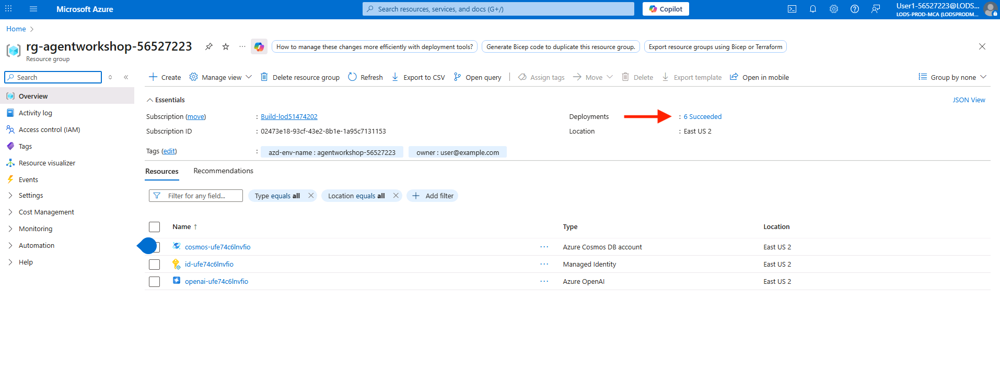
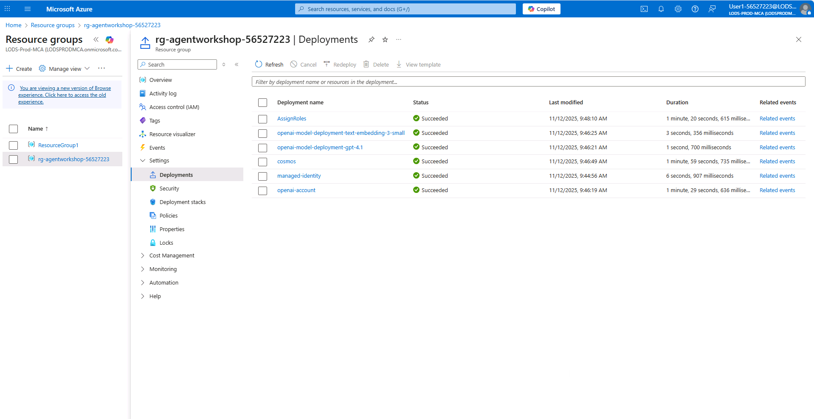
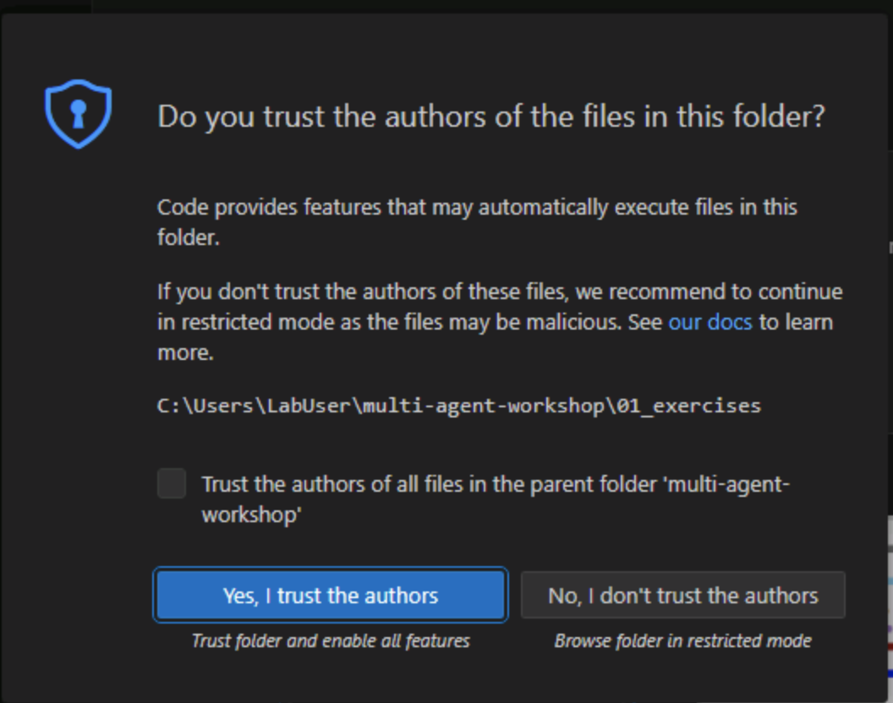

# Module 00 - Deployment and Setup

**[< Home](./Home.md)** - **[Creating Your First Agent >](./Module-01.md)**

## Introduction

Welcome to the Travel Assistant Multi-Agent Workshop! In this module, you'll set up your development environment, seed the database with initial data, and verify that both the API server and frontend are running correctly.

## Learning Objectives

- Set up a Python virtual environment
- Seed Cosmos DB with initial data (users, places, and memories)
- Start the API server using Uvicorn
- Launch the frontend Angular application
- Verify data in Cosmos DB containers
- Explore the frontend interface

## Module Exercises

1. [Activity 1: Verify the resources in Azure Portal](#activity-1-verify-the-resources-in-azure-portal)
2. [Activity 2: Set Up Your Development Environment](#activity-2-set-up-your-development-environment)
3. [Activity 3: Start the API Server](#activity-3-start-the-api-server)
4. [Activity 4: Launch the Frontend](#activity-4-launch-the-frontend)
5. [Activity 5: Verify Your Setup](#activity-5-verify-your-setup)

---

## Activity 1: Verify the resources in Azure Portal

Verify the resources are correctly deployed in the Azure Portal

- Open a browser locally on the VM and navigate to +++https://portal.azure.com+++ 
- Login using the credentials below 
- User name +++@lab.CloudPortalCredential(User1).Username+++ 
- Temporary Access Pass +++@lab.CloudPortalCredential(User1).AccessToken+++ 
- In the Search box at the top of the Azure Portal, type in `resource group`. Open the Resource groups blade 
- Open the resource group that starts with: rg-agentworkshop-. 
- If the resource group does not appear wait a few moments then refresh. 
- When the new resource group appears, expand the Overview tab and click deployments.



- If all resources have been deployed successfully, you are ready to begin the lab. Your screen should look like this.



- Leave this browser open to the Azure Portal.

## Activity 2: Set Up Your Development Environment

### Step 1: Navigate to the Workshop Directory

Open PowerShell and navigate to the workshop **\multi-agent-workshop\01_exercises** directory:

```powershell
cd multi-agent-workshop\01_exercises
```

### Step 2: Activate the Virtual Environment

Activate the virtual environment using PowerShell:

```powershell
.\venv\Scripts\Activate.ps1
```

You should see **(venv)** appear in your terminal prompt, indicating the virtual environment is active.

> **Note:** If you encounter an execution policy error, run PowerShell as Administrator and execute:
>
> ```powershell
> Set-ExecutionPolicy -ExecutionPolicy RemoteSigned -Scope CurrentUser
> ```

### Step 3: Open Visual Studio Code with our project loaded:

```powershell
code .
```

Trust the authors after opening visual studio code, by clicking on the **Yes, I trust the authors** button, like below.



## Activity 3: Start the API Server

Let's start the backend API server.

### Step 1: Navigate to the Source Directory

```powershell
cd .\python\src\app
```

### Step 2: Start the API Server with Uvicorn

Run the API server using Uvicorn:

```powershell
uvicorn travel_agents_api:app --reload --host 0.0.0.0 --port 8000
```

Alternatively, you can run it directly with Python:

```powershell
python travel_agents_api.py
```

### Expected Output

You should see:

```
INFO:     Started server process
INFO:     Waiting for application startup.
INFO:     Application startup complete.
INFO:     Uvicorn running on http://0.0.0.0:8000 (Press CTRL+C to quit)
```

### Verify the API

Open your browser and navigate to:
- **API Documentation**: **http://localhost:8000/docs**
- **Health Check**: **http://localhost:8000/health**

You should see the FastAPI Swagger UI with all available endpoints.

> **Keep this terminal open** - The API server needs to remain running for the frontend to work.

---

## Activity 4: Launch the Frontend

Now let's start the Angular frontend application.

### Step 1: Open a New Terminal

Open a new PowerShell window/tab (keep the API server running in the first terminal).

### Step 2: Navigate to the Frontend Directory

```powershell
cd multi-agent-workshop\01_exercises\frontend
```

### Step 3: Install Node Dependencies

Install the required npm packages:

```powershell
npm install
```

This will install:

- Angular framework and CLI
- TypeScript
- RxJS
- Development dependencies

### Step 4: Start the Frontend Server

Start the Angular development server:

```powershell
npm start
```

### Expected Output

You should see:

```
✔ Browser application bundle generation complete.

Initial Chunk Files   | Names         |  Size
main.js               | main          |  XX KB
polyfills.js          | polyfills     |  XX KB
styles.css            | styles        |  XX KB

                      | Initial Total |  XX KB

Build at: 2025-11-05T12:00:00.000Z - Hash: xxxxx
✔ Compiled successfully.
✔ Browser application bundle generation complete.

** Angular Live Development Server is listening on localhost:4200 **
```

### Access the Frontend

Open your browser and navigate to:

**http://localhost:4200**

---

## Activity 5: Verify Your Setup

Now that everything is running, let's verify the setup is correct.

### Step 1: Verify Data in Cosmos DB

Let's check that data was loaded correctly in Cosmos DB.

1. **Open the Azure Portal**: **https://portal.azure.com**
2. **Navigate to your Cosmos DB account**
3. **Go to Data Explorer**

Check the following containers:

#### Users Container

- **Container**: **Users**
- **Expected**: 4 user documents
- **Check for users**:
  - Tony Stark (**tony**)
  - Steve Rogers (**steve**)
  - Peter Parker (**peter**)
  - Bruce Banner (**bruce**)

#### Places Container

- **Container**: **Places**
- **Expected**: ~2,900 place documents
- **Categories**: Hotels, Restaurants, Activities
- **Sample cities**: Seattle, Tokyo, Paris, London, New York, etc.

Example place document structure:

```json
{
  "id": "hotel-seattle-001",
  "placeId": "hotel-seattle-001",
  "name": "Four Seasons Hotel Seattle",
  "type": "hotel",
  "city": "Seattle",
  "country": "USA",
  "description": "Luxury waterfront hotel...",
  "embedding": [0.123, -0.456, ...],
  ...
}
```

#### Memories Container

- **Container**: **Memories**
- **Expected**: 10 pre-existing memory documents
- **Users with memories**:
  - Tony Stark (5 memories)
  - Steve Rogers (5 memories)

Example memory document structure:

```json
{
  "id": "mem_tony_001",
  "memoryId": "mem_tony_001",
  "userId": "tony_stark",
  "tenantId": "default",
  "memoryText": "Tony prefers luxury hotels with modern architecture",
  "category": "hotel",
  "embedding": [0.789, -0.234, ...],
  "metadata": {
    "extractedFrom": "conversation",
    "confidence": "high"
  },
  ...
}
```

### Step 2: Explore the Frontend

Open the frontend at **http://localhost:4200**

#### Home Page

You should see:

- Welcome message
- Navigation menu with "Explore" and "Chat Assistant" options
- Brief introduction to the travel assistant

#### Explore Page

Click on "Explore" in the navigation menu. You should see:

- **City selector** dropdown
- **Category filters**: Hotels, Restaurants, Activities
- **Place cards** displaying places for the selected city

Try selecting different cities and categories to browse the available places:

- Select "Seattle" and "Hotels" to see Seattle hotels
- Select "Tokyo" and "Restaurants" to see Tokyo restaurants
- Select "Paris" and "Activities" to see Paris activities

#### Chat Assistant Page (Not Yet Functional)

Click on "Chat Assistant" in the navigation menu. You should see:

- Chat interface with message input
- **Expected behavior**: The chat assistant will respond with "Chat completion not implemented yet."
- **This is normal!** We haven't implemented the agents yet

> **Note:** In Module 01, you'll build your first agent to make the chat assistant functional.

---

## Success Criteria

Your setup is successful if you can verify:

✅ **Python virtual environment created** and activated  
✅ **Dependencies installed** without errors  
✅ **Environment variables configured** in **.env** file  
✅ **Database seeded successfully**:

- 4 users in the Users container
- ~2,900 places in the Places container
- 10 memories in the Memories container  
  ✅ **API server running** on http://localhost:8000  
  ✅ **API documentation accessible** at http://localhost:8000/docs  
  ✅ **Frontend running** on http://localhost:4200  
  ✅ **Explore page functional** and displays places correctly  
  ✅ **Chat Assistant page loads** (even though chat doesn't work yet)

---

## Troubleshooting

### Issue: Virtual Environment Not Activating

**Solution**: Ensure Python 3.11+ is installed:

```powershell
python --version
```

If you encounter an execution policy error when activating the virtual environment:

```powershell
Set-ExecutionPolicy -ExecutionPolicy RemoteSigned -Scope CurrentUser
```

### Issue: pip install Fails

**Solution**: Upgrade pip and try again:

```powershell
python -m pip install --upgrade pip
pip install -r requirements.txt
```

### Issue: Seed Script Fails with Authentication Error

**Solution**: The **.env** file should already be configured. If you encounter authentication errors:

- Verify **COSMOSDB_ENDPOINT** and **COSMOS_KEY** in **python\.env**
- Ensure the values match your Azure Cosmos DB account
- Contact the workshop instructor if credentials are incorrect

### Issue: Database or Containers Not Found

**Solution**: The Cosmos DB database and containers should already exist. If you encounter errors:

- Verify you're connected to the correct Azure subscription
- Contact the workshop instructor to verify infrastructure deployment

### Issue: API Server Won't Start

**Solution**:

1. Check if port 8000 is already in use:
   ```powershell
   netstat -ano | findstr :8000
   ```
2. Kill the process or change the port in **.env**

### Issue: Frontend Won't Start

**Solution**:

1. Ensure Node.js 18+ is installed:
   ```powershell
   node --version
   ```
2. Clear npm cache and reinstall:
   ```powershell
   npm cache clean --force
   Remove-Item -Recurse -Force node_modules, package-lock.json
   npm install
   ```

### Issue: Explore Page Shows No Data

**Solution**:

1. Verify the API server is running
2. Check browser console for errors (F12)
3. Verify the proxy configuration in **frontend/proxy.conf.json**:
   ```json
   {
     "/api": {
       "target": "http://localhost:8000",
       "secure": false
     }
   }
   ```

---

## Summary

Congratulations! You've successfully:

- Set up your Python development environment with a virtual environment
- Seeded Cosmos DB with users, places, and memories
- Started the API server using Uvicorn
- Launched the Angular frontend application
- Verified data in Cosmos DB containers
- Explored the frontend interface

With your environment set up and verified, you're ready to start building your first agent!

**Next**: [Module 01 - Creating Your First Agent](./Module-01.md)
