# Module 06 - Evaluating Your Multi-Agent Application (Bonus Module)

**[< Observability & Experimentation](./Module-05.md)** - **[Lessons Learned & The Future >](./Module-07.md)**

## Introduction

You've built a sophisticated multi-agent travel assistant with intelligent memory, orchestration, and specialized agents. But how do you know it's working correctly? How do you catch bugs before they reach users? How do you measure improvements when you make changes?

Evaluation is critical for multi-agent systems because they have many moving parts: routing logic, tool selection, memory retrieval, and response generation. A bug in any component can cascade through the system. Without systematic testing, you're flying blind.

In this module, you'll learn how to create comprehensive evaluations for your multi-agent application. You'll build datasets, implement evaluators using both LLM-as-judge and heuristic methods, and learn to interpret results in LangSmith.

## Learning Objectives and Activities

In this module, you will:

- Understand why evaluating multi-agent systems is critical and challenging
- Review the evaluation infrastructure already created in the `evaluation/` folder
- Create evaluation datasets for different test scenarios
- Implement LLM-as-judge evaluators for response quality assessment
- Build heuristic evaluators for routing accuracy and tool usage
- Run evaluations and interpret results in LangSmith
- Learn how to expand your evaluation coverage for production systems

## Module Exercises

1. [Activity 1: Understanding Multi-Agent Evaluation](#activity-1-understanding-multi-agent-evaluation)
2. [Activity 2: Setting Up Your Evaluation Infrastructure](#activity-2-setting-up-your-evaluation-infrastructure)
3. [Activity 3: Running End-to-End Evaluation](#activity-3-running-end-to-end-evaluation)
4. [Activity 4: Running Agent Routing Evaluation](#activity-4-running-agent-routing-evaluation)
5. [Activity 5: Running Tool Usage Evaluation](#activity-5-running-tool-usage-evaluation)
6. [Activity 6: Next Steps - Expanding Your Evaluation Coverage](#activity-6-next-steps---expanding-your-evaluation-coverage)

---

## Activity 1: Understanding Multi-Agent Evaluation

### Why Evaluate Multi-Agent Systems?

Multi-agent systems are complex. Unlike single-model applications, they have multiple points of failure:

- **Routing**: Does the orchestrator send requests to the right specialist?
- **Tool Usage**: Are agents calling the correct tools with proper parameters?
- **Memory**: Are preferences stored, retrieved, and applied correctly?
- **Response Quality**: Are responses accurate, helpful, and natural?

A traditional unit test can check if a function returns the right type, but it can't tell you if your travel assistant's response sounds robotic or if it hallucinated a hotel name. You need a different approach.

### Types of Evaluations

**1. End-to-End Response Quality**

- Measures the overall quality of responses to user questions
- Evaluates accuracy, helpfulness, and conversational tone
- Uses LLM-as-judge to assess subjective qualities

**2. Agent Routing Accuracy**

- Verifies the orchestrator routes requests to the correct specialist
- Ensures "Find hotels in Paris" goes to the hotel agent, not the dining agent
- Uses simple comparisons (heuristic evaluation)

**3. Tool Usage Correctness**

- Checks if agents call the expected tools
- Verifies tools like `extract_preferences` or `discover_places` are invoked
- Measures both precision (no unexpected tools) and recall (all required tools called)

### Evaluation Approaches

**LLM-as-Judge**

- Uses an LLM to evaluate another LLM's output
- Good for subjective criteria like "Is this response helpful?"
- Requires clear grading instructions and structured output
- Example: Evaluating if a response sounds natural and friendly

**Heuristic Evaluators**

- Fast, deterministic checks based on rules
- Good for objective criteria like "Was this tool called?"
- No LLM costs, instant results
- Example: Checking if `actual_route == expected_route`

### Challenges Specific to Multi-Agent Systems

**Non-Determinism**

- Agents may phrase responses differently each time
- Temperature > 0 means variation in outputs
- Solution: Evaluate criteria (correctness, helpfulness) rather than exact text match

**Memory Interference**

- Tests can affect each other through shared memory
- Solution: Use unique tenant/user IDs per test to isolate memory

**Multiple Execution Paths**

- Same question might take different valid paths through agents
- Solution: Define acceptable variations in your test cases

---

## Activity 2: Setting Up Your Evaluation Infrastructure

The evaluation infrastructure has already been created in the `evaluation/` folder. Let's review its structure.

### Evaluation Folder Structure

```
01_exercises/evaluation/
├── datasets/                    # Test datasets in JSON format
│   ├── e2e_dataset.json         # End-to-end response quality tests (6 cases)
│   ├── routing_dataset.json     # Agent routing tests (8 cases)
│   └── tool_usage_dataset.json  # Tool calling pattern tests (4 cases)
├── evaluators/                  # Evaluation functions
│   ├── __init__.py
│   ├── llm_judges.py            # LLM-as-judge evaluators
│   └── heuristic_evaluators.py  # Fast heuristic checks
├── e2e_evaluation.py            # End-to-end evaluation script
├── routing_evaluation.py        # Agent routing evaluation script
├── tool_usage_evaluation.py     # Tool usage evaluation script
```

### Understanding the Datasets

Each dataset is a JSON file containing test cases with inputs and expected outputs.

**Example from `e2e_dataset.json`:**

```json
{
  "inputs": {
    "question": "Find me hotels in Barcelona"
  },
  "outputs": {
    "answer": "Before I search for hotels in Barcelona, I'd love to personalize my recommendations for you. Do you have any preferences or requirements",
    "expected_tools": ["recall_memories", "discover_places"],
    "expected_agent": "hotel"
  }
}
```

This test case checks:

- The response quality (does it appropriately ask for preferences?)
- The tools called (recall_memories and discover_places)
- The agent routing (should go to hotel agent)

### Understanding the Evaluators

**LLM Judges** (`evaluators/llm_judges.py`):

1. **`answer_quality`**: Evaluates overall response quality

   - Relevance, helpfulness, accuracy, completeness
   - Returns: Boolean (True if quality meets criteria)

2. **`correctness`**: Evaluates factual accuracy only

   - No hallucinations, consistent information
   - Returns: Boolean (True if factually correct)

3. **`humanness`**: Evaluates conversational quality
   - Natural language, appropriate tone, empathy
   - Returns: Integer score 1-5 (5 = exceptionally natural)

**Heuristic Evaluators** (`evaluators/heuristic_evaluators.py`):

1. **`correct_routing`**: Verifies orchestrator routing decisions
2. **`required_tools_called`**: Confirms all required tools were invoked
3. **`tool_call_accuracy`**: Calculates precision/recall of tool usage (0.0-1.0)

### Understanding the Evaluation Scripts

Each script follows this pattern:

1. Load environment variables
2. Initialize Cosmos DB and agents
3. Load dataset from JSON file
4. Create/update LangSmith dataset
5. Define target function (runs the agent and captures outputs)
6. Run evaluation with appropriate evaluators
7. Results automatically logged to LangSmith

---

## Activity 3: Running End-to-End Evaluation

End-to-end evaluation tests the complete user journey from question to final answer.

### Step 1: Review the E2E Dataset

Open `evaluation/datasets/e2e_dataset.json` and review the test cases.

You'll see 6 examples covering different scenarios:

- Hotel searches
- Restaurant preferences
- Itinerary creation
- Preference queries
- Preference extraction

Each test case has:

- `question`: The user's input
- `answer`: The expected response pattern (not exact match)
- `expected_tools`: Tools that should be called
- `expected_agent`: Which specialist should handle the request

### Step 2: Understand the Evaluators

The E2E evaluation uses three LLM-as-judge evaluators:

**`answer_quality`**

- Compares student response to reference response
- Checks relevance, helpfulness, accuracy, completeness
- Allows responses with MORE detail than reference
- Encourages clarifying questions

**`correctness`**

- Focuses purely on factual accuracy
- Ensures no hallucinations or made-up information
- Allows appropriate follow-up questions

**`humanness`**

- Scores conversational quality on 1-5 scale
- Evaluates natural language, tone, empathy, clarity
- 5 = exceptionally natural, 1 = robotic

### Step 3: Run the Evaluation Script

**Make sure your MCP server is running:**

```powershell
cd mcp_server
$env:PYTHONPATH="..\python"; python mcp_http_server.py
```

**Important**: Always ensure your virtual environment is activated before starting the server!

You must be in **multi-agent-workshop\01_exercises** folder and then use the below commands to activate the virtual environment. And after activating the environment, follow the above commands to re-start the mcp server.  

```powershell
cd multi-agent-workshop\01_exercises
.\venv\Scripts\Activate.ps1
```

**Now run the E2E evaluation, Open a new terminal tab**

```powershell
cd multi-agent-workshop\01_exercises\evaluation
.\venv\Scripts\Activate.ps1
$env:PYTHONPATH="..\python"; python e2e_evaluation.py
```

You'll see output like:

```
============================================================
🧪 END-TO-END EVALUATION - Travel Assistant
============================================================

🔄 Initializing Cosmos DB...
✅ Cosmos DB initialized
🔄 Setting up agents...
✅ Agents initialized
🔄 Building agent graph...
✅ Agent graph ready

📊 Loading dataset from evaluation/datasets/e2e_dataset.json...
✅ Loaded 6 examples
🔄 Creating dataset 'travel-assistant-e2e-eval'...
✅ Dataset created with 6 examples

============================================================
🚀 RUNNING EVALUATION
============================================================

[Progress indicators as each test runs...]

============================================================
✅ EVALUATION COMPLETE
============================================================
```

### Step 4: What Happened?

The evaluation script:

1. Initialized your multi-agent system
2. Loaded 6 test cases from the JSON file
3. Created a LangSmith dataset
4. For each test case:
   - Ran the question through your agent graph
   - Captured the response
   - Applied all three LLM-as-judge evaluators
   - Logged results to LangSmith
5. Generated an experiment in LangSmith with all results

### Step 5: Viewing Results in LangSmith

Navigate to the LangSmith dashboard at https://smith.langchain.com

Click on "Datasets & Experiments" in the left sidebar, you would see the list of experiments you ran.

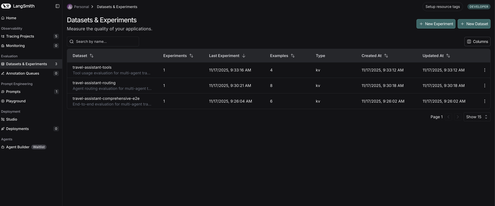

You should see the **travel-assistant-comprehensive-e2e** experiment.

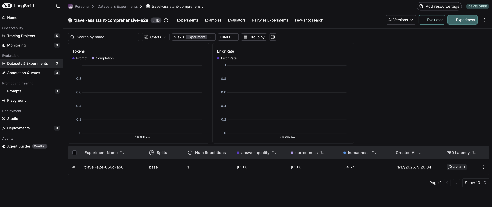

Click on the experiment to see detailed results.

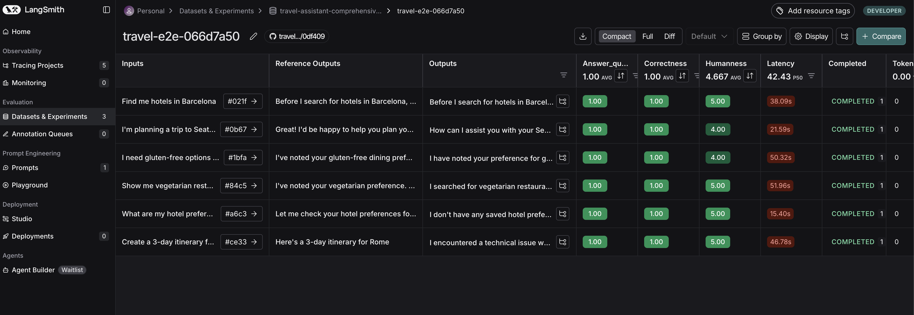

You'll see:

- Overall statistics (how many passed/failed)
- Individual test case results
- Scores for each evaluator (answer_quality, correctness, humanness)

Click on any individual test case to see full details.

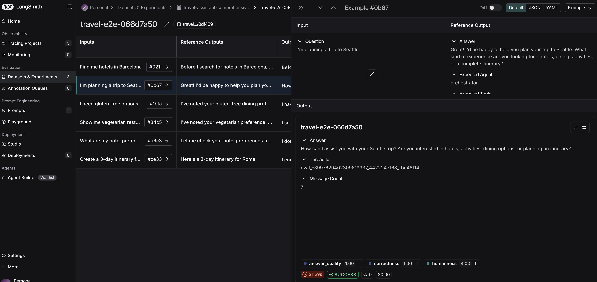

You can see:

- The input question
- Your agent's actual response
- The expected reference response
- Each evaluator's score and reasoning

### Step 6: Viewing the Dataset

Go back to the "Datasets & Experiments", and click on the **travel-assistant-comprehensive-e2e** experiment. Now go the to tab **examples** next to the **experiments** tab.

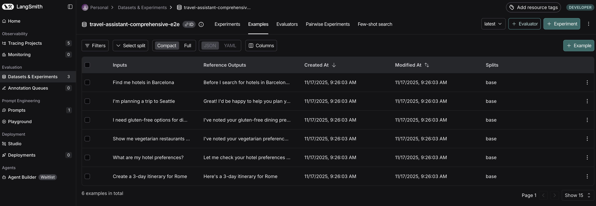

You can:

- View all test examples
- Add new examples directly in the UI
- Edit existing examples
- Delete examples
- Export the dataset

This is useful for managing your test cases without editing JSON files directly.

---

## Activity 4: Running Agent Routing Evaluation

Routing evaluation verifies that the orchestrator correctly routes requests to specialist agents.

### Step 1: Review the Routing Dataset

Open `evaluation/datasets/routing_dataset.json` and review the 8 test cases.

Examples:

- "Find hotels in Barcelona" → Expected route: `hotel`
- "I need vegetarian restaurants" → Expected route: `orchestrator` (preference extraction)
- "Show me museums in London" → Expected route: `activity`
- "I prefer luxury hotels" → Expected route: `orchestrator` (preference only, no search)

### Step 2: Understand the Routing Evaluator

The routing evaluation uses one heuristic evaluator:

**`correct_routing`**

- Compares `actual_route` to `expected_route`
- Returns True if they match, False otherwise
- Fast, deterministic check

How routing is determined:

- If the orchestrator delegates to a specialist, return the specialist name
- If the orchestrator handles it alone, return "orchestrator"
- This tests whether the orchestrator makes the right routing decision

### Step 3: Run the Routing Evaluation
In the same terminal window, where you ran the e2e evaluation, run the below command to start the agent routing evaluations.

```powershell
$env:PYTHONPATH="..\python"; python routing_evaluation.py
```

You'll see similar output to the E2E evaluation, but focused on routing accuracy.

### Step 4: Brief Explanation

The routing evaluation:

1. Runs each question through the agent graph
2. Tracks which agents are visited using event streaming
3. Determines the primary agent that handled the request
4. Compares to the expected route
5. Logs pass/fail for each test case

### Step 5: Viewing Results in LangSmith

Click on "Datasets & Experiments" in the left sidebar, you would see the list of experiments you ran.


You should see the **travel-assistant-routing** experiment.

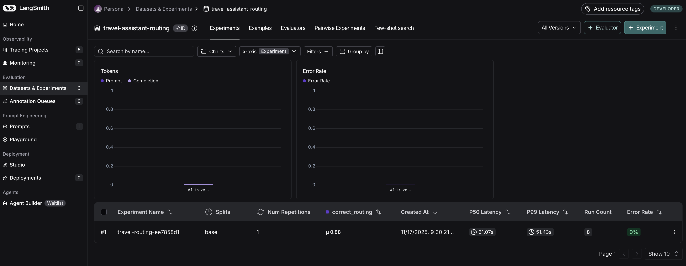

Click on the experiment to see detailed results.

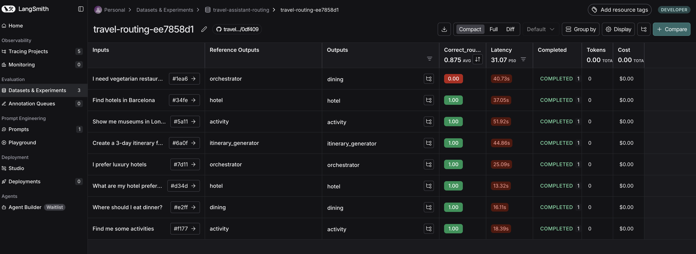

You'll see:

- Which test cases passed (correct routing)
- Which test cases failed (incorrect routing)
- For failures, you can see what route was taken vs expected

Click on any individual test case to see full details.

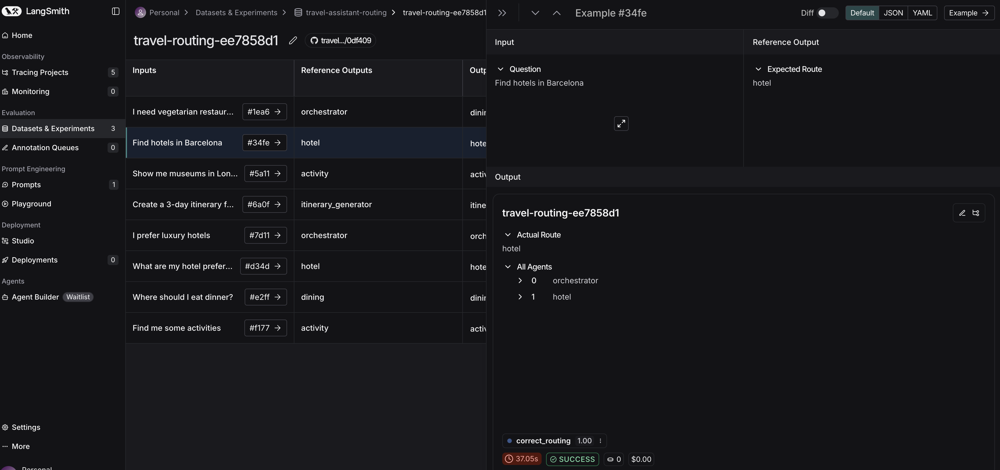

You can see:

- The input question
- Your agent's actual response
- The expected reference response
- Each evaluator's score and reasoning

This helps identify routing bugs, like the orchestrator sending hotel queries to the dining agent.

### Step 6: Viewing the Dataset

Go back to the "Datasets & Experiments", and click on the **travel-assistant-routing** experiment. Now go the to tab **examples** next to the **experiments** tab.

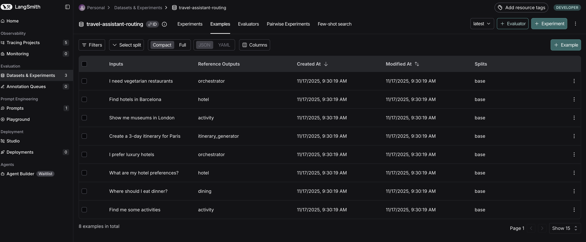

Review the test cases and their expected routing decisions. You can add more routing scenarios here to expand coverage.

---

## Activity 5: Running Tool Usage Evaluation

Tool usage evaluation ensures agents call the correct tools for different scenarios.

### Step 1: Review the Tool Usage Dataset

Open `evaluation/datasets/tool_usage_dataset.json` and review the 4 test cases.

Examples:

- "I prefer budget hotels" → Required tools: `extract_preferences_from_message`, `resolve_memory_conflicts`, `store_resolved_preferences`, `transfer_to_hotel`
- "Find hotels in Barcelona" → Required tools: `extract_preferences_from_message`, `transfer_to_hotel`, `recall_memories`, `discover_places`

### Step 2: Understand the Tool Evaluators

The tool usage evaluation uses two heuristic evaluators:

**`required_tools_called`**

- Checks if ALL required tools were called
- Returns True only if every required tool appears in the tools_called list
- Returns False if any required tool is missing

**`tool_call_accuracy`**

- Calculates a score from 0.0 to 1.0
- Measures both precision (no unexpected tools) and recall (all required tools)
- Formula: (correct_calls / total_calls) - (missing_required \* 0.2)
- Penalizes missing required tools

### Step 3: Run the Tool Usage Evaluation

In the same terminal window, where you ran the agent routing evaluation, run the below command to start the tool usage evaluations.

```powershell
$env:PYTHONPATH="..\python"; python tool_usage_evaluation.py
```

The script will run all 4 test cases and evaluate tool calling patterns.

### Step 4: Brief Explanation

The tool usage evaluation:

1. Runs each question through the agent graph
2. Tracks which tools are called using event streaming
3. Compares the tools_called list to required_tools
4. Calculates both boolean (all required called?) and accuracy score
5. Logs results to LangSmith

### Step 5: Viewing Results in LangSmith

Click on "Datasets & Experiments" in the left sidebar, you would see the list of experiments you ran.


You should see the **travel-assistant-tools** experiment.

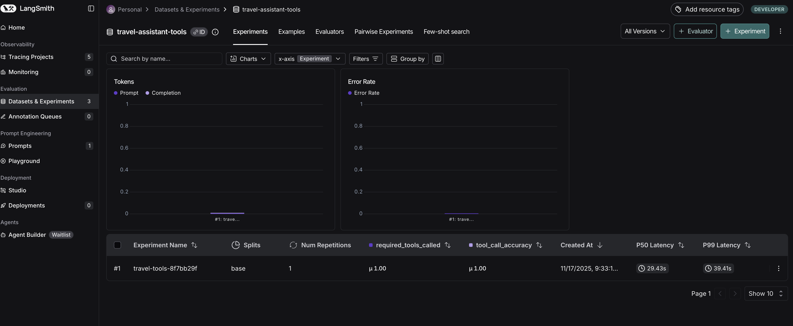

Click on the experiment to see detailed results.

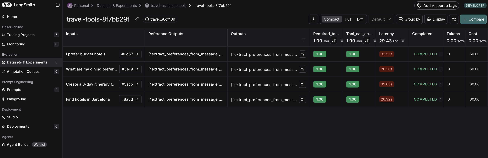

You'll see:

- Which test cases passed (all required tools called)
- Tool call accuracy scores (0.0 - 1.0)
- For each case, the list of tools that were called

Click on any individual test case to see full details.

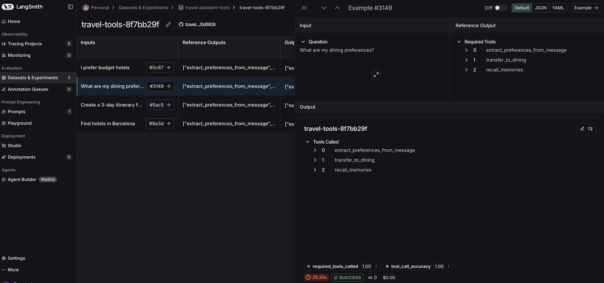

You can see:

- The input question
- Your agent's actual response
- The expected reference response
- Each evaluator's score and reasoning

This helps identify when agents skip important tools or call unnecessary ones.

### Step 6: Viewing the Dataset

Go back to the "Datasets & Experiments", and click on the **travel-assistant-routing** experiment. Now go the to tab **examples** next to the **experiments** tab.

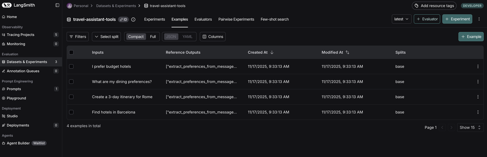

Review the required tools for each scenario. You can add more tool usage patterns to test edge cases.

---

## Activity 6: Next Steps - Expanding Your Evaluation Coverage

Now that you have a working evaluation infrastructure, here are ways to expand and improve your testing.

### 1. Memory Integration Testing

Test if preferences are correctly stored, retrieved, and applied:

**Preference Storage**

- "I prefer budget hotels" → Check if preference is stored in Cosmos DB
- Verify the preference appears in memory when queried

**Preference Recall**

- After storing "vegetarian" preference, ask "Show me restaurants in Paris"
- Verify the agent recalls the vegetarian preference
- Check if only vegetarian restaurants are returned

**Conflict Resolution**

- "I prefer budget hotels" → "Show me luxury hotels"
- Verify the system detects and resolves the conflict
- Check if the user is asked to clarify

Example test case for conflict resolution:

```json
{
  "inputs": {
    "question": "I want luxury hotels",
    "previous_preferences": ["budget hotels"]
  },
  "outputs": {
    "answer": "I notice you previously preferred budget hotels, but now you're asking for luxury hotels. Would you like me to update your preference?",
    "expected_tools": [
      "recall_memories",
      "detect_conflict",
      "resolve_memory_conflicts"
    ]
  }
}
```

### 2. Conversation Flow Testing

Test multi-turn conversations and context retention:

**Context Retention**

- Turn 1: "Find hotels in Paris"
- Turn 2: "What about restaurants?" (should remember Paris context)
- Verify the agent searches for restaurants in Paris, not a generic search

**Auto-Summarization**

- Create a conversation with 20+ messages
- Verify summarization is triggered
- Check that key preferences are retained in the summary
- Ensure conversation context isn't lost after summarization

Example multi-turn test:

```json
{
  "inputs": {
    "conversation": [
      "Find me hotels in Barcelona",
      "I prefer something near the beach",
      "What about restaurants nearby?"
    ]
  },
  "outputs": {
    "final_answer_should_mention": ["Barcelona", "beach", "restaurants"],
    "expected_tools": ["recall_memories", "discover_places"],
    "context_retained": true
  }
}
```

### 3. Edge Cases

Test unusual or problematic scenarios:

**Ambiguous Queries**

- "Find me a place" → Should ask for clarification
- "I need something nice" → Should ask what type (hotel, restaurant, activity)

**Invalid Locations**

- "Hotels in Atlantis" → Should handle gracefully, not hallucinate
- "Restaurants on Mars" → Should explain the location doesn't exist

**Conflicting Preferences**

- "Cheap luxury hotels" → Should detect the contradiction
- "Budget 5-star restaurants" → Should ask for clarification

**Empty Results**

- Search that returns no results → Should explain and offer alternatives
- "Vegan steakhouse" → Should handle the contradiction gracefully

Example edge case test:

```json
{
  "inputs": {
    "question": "Find me a cheap luxury hotel in Atlantis"
  },
  "outputs": {
    "should_ask_for_clarification": true,
    "should_not_hallucinate": true,
    "should_explain_issues": ["conflicting_preferences", "invalid_location"]
  }
}
```

### 4. Performance Testing

Measure and track system performance:

**Response Latency**

- Track average response time per agent type
- Identify slow agents or tools
- Set acceptable thresholds (e.g., <3 seconds for hotel search)

**Token Usage and Cost**

- Measure tokens consumed per query type
- Calculate cost per interaction
- Identify opportunities for optimization

**Database Query Performance**

- Count Cosmos DB queries per request
- Measure vector search latency
- Optimize slow queries

Example performance test:

```python
import time

def test_hotel_search_performance():
    start = time.time()
    response = await graph.ainvoke({"messages": [HumanMessage("Find hotels in Paris")]})
    duration = time.time() - start

    assert duration < 3.0, f"Hotel search took {duration}s, expected <3s"
    assert count_tokens(response) < 1000, "Response used too many tokens"
```

### 5. Continuous Evaluation

Set up automated evaluation runs to catch regressions:

**On Code Changes**

- Run evaluations before merging pull requests
- Compare results to baseline
- Block merges if quality decreases

**Scheduled Runs**

- Run full evaluation suite nightly
- Track trends over time
- Alert on degradation

**Experiment Comparison**

- Use LangSmith to compare experiments
- A/B test different prompts or configurations
- Make data-driven decisions

Example CI/CD integration:

```yaml
# .github/workflows/evaluation.yml
name: Run Evaluations
on: [pull_request]

jobs:
  evaluate:
    runs-on: ubuntu-latest
    steps:
      - uses: actions/checkout@v2
      - name: Run E2E Evaluation
        run: python evaluation/e2e_evaluation.py
      - name: Check Results
        run: python scripts/check_evaluation_results.py
```

### 6. Dataset Expansion

Continuously improve your test coverage:

**Add Real User Queries**

- Collect actual user questions from production logs
- Turn common queries into test cases
- Test edge cases discovered by users

**Test Different User Personas**

- Budget travelers (focus on cost)
- Luxury seekers (focus on quality)
- Families (focus on family-friendly options)
- Business travelers (focus on location, amenities)

**Multi-Lingual Support**

- If applicable, test queries in different languages
- Verify responses maintain quality across languages

**Accessibility Scenarios**

- "Wheelchair accessible hotels"
- "Hotels with braille signage"
- "Restaurants with quiet dining areas"

**Example: Adding a New Test Case**

To add a new test case, edit `evaluation/datasets/e2e_dataset.json`:

```json
{
  "inputs": {
    "question": "Find wheelchair accessible hotels near museums in London"
  },
  "outputs": {
    "answer": "Let me find wheelchair accessible hotels near museums in London for you.",
    "expected_tools": ["recall_memories", "discover_places"],
    "expected_agent": "hotel",
    "accessibility_mentioned": true
  }
}
```

Then re-run the evaluation:

```bash
python evaluation/e2e_evaluation.py
```

The new test case will be included in the next evaluation run.

---

## Summary

In this module, you learned how to systematically evaluate your multi-agent travel assistant:

- Why evaluation is critical for multi-agent systems
- How to structure evaluation datasets for different test types
- Using LLM-as-judge for subjective quality assessment
- Using heuristic evaluators for objective criteria
- Running evaluations and interpreting results in LangSmith
- Expanding evaluation coverage for production readiness

Evaluation isn't a one-time activity. As your system evolves, your test suite should grow with it. Start with basic smoke tests, then add edge cases as you discover them. Track performance over time and use data to guide improvements.

With comprehensive evaluation in place, you can make changes confidently, knowing you'll catch regressions before they reach users.

---

**[< Observability & Experimentation](./Module-05.md)** - **[Lessons Learned & The Future >](./Module-07.md)**
